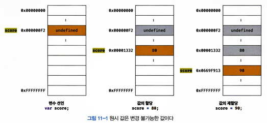
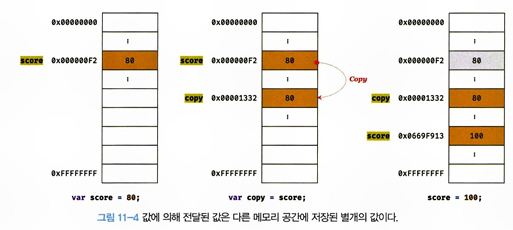
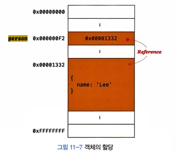
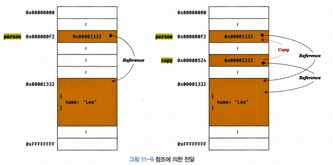

# 11장 원시 값과 객체의 비교
자바스크립트의 데이터 타입은 크게 `원시 타입`과 `객체 타입`으로 구분할 수 있다.
- 원시 타입의 값은 **변경 불가능한 값**이다. 객체 타입의 값, 즉 객체는 **변경 가능한 값**이다.
- 원시 값을 변수에 할당하면 변수에는 **실제 값**이 저장된다. 객체는 변수에 할당하면 변수에는 **참조 값**이 저장된다.
- 원시 값을 갖는 변수를 다른 변수에 할당하면 원시 값이 복사되어 전달된다. **값에 의한 전달**이라 한다. 객체를 가리키는 변수를 다른 변수에 할당하면 원본의 **참조 값**이 복사되어 전달된다.

## 11.1 원시 값
원시 타입의 값은 **변경 불가능한 값**이다. 이 말은 원시 값 자체를 변경할 수 없다는 의미이지, 변수 값은 변경할 수 없다는 것은 아니다. **변수**는 하나의 값을 저장하기 위해 확보된 메모리 공간을 말하고 값은 변수에 저장된 데이터로서 표현식이 평가되어 생성된 결과를 말한다. **변경 불가능한 것은 변수가 아니라 값에 대한 진술이다.** <br/>
재할당이 금지된 변수는 `상수`라 한다. 상수는 값을 한 번만 할당 할 수 있다.
```
const o = {};

// const 키워드를 사용해 선언한 변수에 할당한 원시 값은 변경할 수 없다.
// 하지만, 객체는 변경할 수 있다.
o.a = 1;
console.log(o); // {a: 1}
```

원시 값을 할당한 변수에 새로운 원시 값을 재할당하면 메모리 공간에 저장되어 있는 재할당 이전의 원시 값을 변경하는 것이 아니라 **새로운 메모리 공간을 확보**하고 **재할당한 원시 값을 저장**한 후, **변수는 새롭게 재할당한 원시 값을 가리킨다.** <br/>
 <br/>
이러한 특성을 `불변성`이라 한다. 불변성을 갖는 원시 값을 할당한 변수는 재할당 이외에 변수 값을 변경할 수 있는 방법이 없다. <br/>

원시 값을 저장하려면 먼저 확보해야하는 메모리 공간의 크기를 결정해야 한다. 1개의 문자는 2바이트 메모리 공간에 저장된다. 숫자는 8바이트가 필요하다.
```
let str = 'string';

// 문자열은 *유사 배열이므로 배열과 유사하게 인덱스를 사용해 각 문자에 접근할 수 있다. 
// 하지만 문자열은 원시 값이므로 변경할 수 없다. 이때 에러가 발생하지 않는다.
str[0] = 'S';

console.log(str); //string
```

*유사 배열 : 마치 배열처럼 인덱스로 프로퍼티 값에 접근할 수 있고 length 프로퍼티를 갖는 객체를 말한다. 
```
let str = 'string';

// 문자열은 유사 배열이므로 배열과 유사하게 인덱스를 사용해 각 문자에 접근할 수 있다.
console.log(str[0]);

// 원시 값인 문자열이 객체처럼 동작한다.
console.log(str.length); //6
console.log(str.toUpperCase()); //STRING
```

```
let score = 80;
let copy = score;

console.log(score); //80
console.log(copy); //80
console.log(score === copy); //true

score = 100;

console.log(score); //100
console.log(copy); //80
console.log(score === copy); //false
```
score의 값을 copy에 할당해 주었지만, 각자 다른 메모리 공간에 저장된 값이기에 서로 영향을 주지 않는다. <br/>


```
var x = 10;
```
: 식별자로 값을 구별해서 식별한다는 것은 식별자가 기억하고 있는 메모리 주소를 통해 메모리 공간에 저장된 값에 접근할 수 있다는 것을 의미한다. 즉, 식별자는 메모리 주소에 붙인 이름이라 할 수 있다. 위는 식별자 x는 메모리 공간에 저장된 숫자 값 10을 식별할 수 있다.

```
var copy = score;
```
위는 두 가지 평가 방식이 가능하다. 
1. 새로운 80을 생성해서 메모리 주소를 전달하는 방식, 이 방식은 할당 시점에 두 변수가 기억하는 메모리 주소가 다르다.
2. score의 변수값 80의 메모리 주소를 그대로 전달하는 방식, 할당 시점에 두 변수가 기억하는 메모리 주소가 같다. 

이처럼 **값의 의한 전달**도 사실은 **값을 전달하는 것이 아닌 메모리 주소를 전달**한다. 단, 전달된 메모리 주소를 통해 메모리 공간에 접근하면 값을 참조할 수 있다. 

## 11.2 객체
객체는 복합적인 자료구조 이므로 어느것도 정해져 있지 않다. 그리고 객체는 **변경 가능한 값**이다.
```
var person = {
    name: 'Jang'
};
```
객체를 할당한 변수가 기억하는 메모리 주소를 통해 메모리 공간에 접근하면 참조 값에 접근할 수 있다. 참조 값은 생성된 객체가 저장된 메무리 공간의 주소, 그 자체이다. <br/>
<br/>
원시 값은 변경 불가능한 값이므로 원시 값을 갖는 변수의 값을 변경하려면 재할당 외에는 방법이 없다. 하지만 객체는 변경가능한 값이다. 따라서 객체를 할당한 변수는 재할당 없이 객체를 직접 변경할 수 있다. 즉, 재할당 없이 프로퍼티를 동적으로 추가할 수 있고 프로퍼티 값을 갱신할 수도 있으며 프로퍼티 자체를 삭제할 수도 있다.<br/> 객체를 변경할 때마다 원시값처럼 이전 값을 복사해서 새롭게 생성한다면 명확하고 신뢰성이 보장되겠지만, 크기가 매우 클수도 있고, 크기가 일정하지 않으며, 프로퍼티 값이 객체일 수도 있기에 복사하는데 비용이 많이 든다. 

### [얕은 복사](https://developer.mozilla.org/ko/docs/Glossary/Shallow_copy) / [깊은 복사](https://developer.mozilla.org/ko/docs/Glossary/Deep_copy)
[학습 블로그](https://velog.io/@bamtol/%EC%96%95%EC%9D%80%EB%B3%B5%EC%82%AC-%EA%B9%8A%EC%9D%80%EB%B3%B5%EC%82%AC) <br/>
- 얕은 복사 : 한 단계까지만 복사하는 것 - 복사본의 속성이 복사본이 만들어진 원본 객체와 같은 참조를 공유하는 복사. 따라서, 원복이나 복사본을 변경하면 다른 객체또한 변경될 수 있다. (대표 : 스프레드 문법)
- 깊은 복사 : 중첩되어있는 객체까지 복사하는 것 - 복사본의 속성이 복사본이 만들어진 원본 객체와 같은 참조를 공유하지 않는 복사. 따라서, 원본이나 복사본을 변경할 때, 다른 객체가 변경되지 않는 것을 보장할 수 있다. (대표 : cloneDeep)
<br/>

- 참조에 의한 전달
```
var person = {
    name: 'Jang'
};

var copy = person; //얕은 복사
```

객체를 가리키는 변수를 다른 변수에 할당하면 원본의 참조 값이 복사되어 전달된다. 이를 **참조에 의한 전달**이라 한다. <br/>
 <br/>
원본과 사본 모두 동일한 객체를 가리킨다. 이것은 두 개의 식별자가 하나의 객체를 공유한다는 것을 의미한다. 그렇기에 **원본 혹은 사본 중 어느 것을 어느 한쪽에서 객체를 변경하면 서로 영향을 주고 받는다.**

```
var person = {
    name: 'Jang'
};

var copy = person;

console.log(person === copy); //true

copy.name = 'Ryu';

person.address = 'Seoul';

console.log(person === copy); //true
console.log(person); // {name: 'Ryu', address: 'Seoul'};
console.log(copy); // {name: 'Ryu', address: 'Seoul'};
```

**값에 의한 전달**과 **참조에 의한 전달**은 식별자가 기억하는 메모리 공간에 저장되어 있는 값을 복사해서 전달한다는 면에서 동일하다. 변수에 저장되어 있는 값이 원시 값이냐 참조 값이냐의 차이만 있을 뿐이다. 따라서 **자바스크립트에는 '참조에 의한 전달'은 존재하지 않고 '값에 의한 전달'만이 존재**한다고 말할 수 있다.

