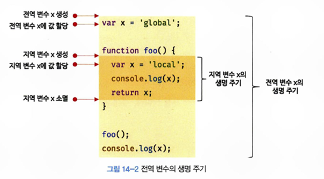

# 14장 전역 변수의 문제점

## 14.1 변수의 생명 주기
변수는 자신이 선언된 위치에서 생성되고 소멸한다. 

### 지역 변수의 생명 주기
```
function foo () {
    var x = 'local';
    console.log(x); // local
    return x;
}
foo();
console.log(x); // ReferenceError
```
: 지역 변수 `x`는 `foo`함수가 호출되기 이전까지는 생성되지 않고, `foo`함수를 호출하면 생성된다. <br/>

'변수 호이스팅'에서 변수 선언은 선언문이 어디에 있든 상관없이 가장 먼저 실행된다고 했지만, 함수 몸체는 함수 호출 이후 실행되기에 함수가 호출되어야 지역변수는 그제서야 생성된다. 그렇기에 **지역 변수의 생명 주기는 함수의 생명 주기와 일치한다.** <br/>

하지만, 함수의 생명 주기보다 오래 생존하는 경우가 있는데, 함수 내부에서 선언된 지역 변순느 함수가 생성한 스코프에 등록되고, 누군가 이 함수의 스코프를 참조하고 있다면 소멸하지 않고 생존해 있다.

```
var x = 'global';
function foo () {
    console.log(x); // undefined
    var x = 'local';
}
foo();
console.log(x); // global
```
: 호이스팅은 스코프를 단위로 동작한다. 그렇기에 함수 내부의 x는 지역 변수 x를 참조한다. 즉, 호이스팅은 변수 선언이 스코프의 선두로 끌어올려진 것처럼 동작하는 자바스크립트의 고유의 특징을 말한다.

### 전역 변수의 생명 주기
전역 코드는 함수 호출과 달리 코드가 로드되자마자 곧바로 해석되고 실행된다. 전역 변수의 생명주기는 전역 객체(브라우저 환경에서 : window)의 생명 주기와 일치한다. <br/>
 <br/>

## 14.2 전역 변수의 문제점
- 암묵적 결합 : 전역 변수는 코드 어디에서든 참조하고 할당할 수 있는 **암묵적 결합**을 허용해 코드의 가독성을 해치고, 의도치 않게 상태가 변경될 수 있다.
- 긴 생명 주기 : 전역 변수는 생명 주기가 길어 메모리 리소스도 오랜 기간 소비한다. 또한 변수 이름이 중복될 가능성이 있다.(var의 경우)
- 스코프 체인 상에서 종점에 존재 : 변수를 검색할 때 전역 변수가 가장 마지막에 검색되기에 검색 속도가 느리다.
- 네임스페이스 오염 : 파일이 분리되어 있어도 전역 스코프를 공유하기에 잘못된 사용을 할 수 있다.

## 14.3 전역 변수의 사용을 억제하는 방법
: 전역 변수 이용의 이유가 없다면 지역 변수를 사용해야한다. 스코프는 좁을 수록 좋다. 
- 즉시 실행 함수 : 모든 코드를 즉시 실행 함수로 감싸면 모든 변수는 즉시 실행 함수의 지역 변수가 된다. 이를 통해 전역 변수의 사용을 제한한다.
- 네임스페이스 객체 : 네임스페이스 역할을 담당할 객체를 생성하고 전역 변수처럼 사용하고 싶은 변수를 프로퍼티로 추가하는 방법
- 모듈 패턴 : 클래스를 모방하여 변수와 함수를 모아 즉시 실행 함수로 감싸 하나의 모듈을 만든다. JS에서는 `private` `public` `protected` 등의 접근 제한자를 제공하지 않아 모듈 패턴을 활용하여 정보 은닉을 구현한다. 
```
var Counter = (function () {
    // private 변수
    var num = 0;

    // 외부에 공개할 데이터(public)
    return {
        increase() {
            return ++num;
        },
        decrease() {
            return --num;
        }
    };
}());
```
-  ES6 모듈 : ES6 모듈은 파일 자체의 독자적인 모듈 스코프를 제공한다. 
```
<script type="module" src="main.mjs"></script>
```
-> 트랜스파일링이나 번들링이 필요하기에 보통 Webpack을 사용하곤 한다.