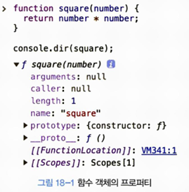

# 18장 함수와 일급 객체
## 18.1 일급 객체
함수가 일급 객체라는 것은 함수가 일반 객체와 동일하게 취급된다는 의미다. 일급 객체의 조건은 다음과 같다:
1. 무명의 리터럴로 생성할 수 있다. 즉, 런타임에 생성이 가능하다.
2. 변수나 자료구조(객체, 배열)에 저장할 수 있다.
3. 함수의 매개변수에 전달할 수 있다.
4. 함수의 반환값으로 사용할 수 있다.

```
// 1. 함수는 무명의 리터럴로 생성할 수 있다.
// 2. 함수는 변수에 저장할 수 있다.
// 런타임(평가 단계)에 함수 리터럴이 평가되어 함수 객체가 생성되고 변수에 할당된다.

const increase = function (num) {
    return ++num;
};

const decrease = function (num) {
    return --num;
};

// 2. 함수는 객체에 저장할 수 있다.
const auxs = { increase, decrease };

// 3. 함수는 매개변수에 전달할 수 있다.
// 4. 함수의 반환값으로 사용할 수 있다.

function makeCounter(aux) {
    let num = 0;

    return function () {
        num = aux(num);
        return num;
    };
}

// 3. 함수는 매개변수에게 함수를 전달할 수 있다.
const increaser = makeCounter(auxs.increase);
console.log(increaser()); // 1
console.log(increaser()); // 2

// 3. 함수는 매개변수에게 함수를 전달할 수 있다.
const decreaser = makeCounter(auxs.decrease);
console.log(decreaser()); // -1
console.log(decreaser()); // -2
```
: 이 코드를 통해 함수가 일급 객체로서 다른 값처럼 자유롭게 사용될 수 있음을 확인할 수 있다. 함수는 값을 사용할 수 있는 곳이라면 어디에서든 정의할 수 있으며, 런타임에 함수 객체로 평가된다.

## 18.2 함수 객체의 프로퍼티
- `console.dir`: 자바스크립트 함수는 객체이므로 프로퍼티를 가질 수 있다. console.dir을 사용하면 함수의 프로퍼티를 확인할 수 있다.
```
function square(num) {
    return num * num;
}

console.dir(square);
```


- `Object.getOwnPropertyDescriptors`: 함수 객체의 프로퍼티에 대한 세부 정보를 확인할 수 있다.
```
function square(number) {
    return number * number;
}

console.log(Object.getOwnPropertyDescriptors(square));
/*
{
    length: {value: 1, writable: false, enumerable: false, configurable: true},
    name: {value: "square", writable: false, enumerable: false, configurable: true},
    arguments: {value: null, writable: false, enumerable: false, configurable: false},
    caller: {value: null, writable: false, enumerable: false, configurable: false},
    prototype: {value: {...}, writable: true, enumerable: false, configurable: false}
}
*/

// __proto__는 square 함수의 프로퍼티가 아니다.
console.log(Object.getOwnPropertyDescriptor(square, '__proto__')); // undefined

// __proto__는 Object.prototype 객체의 접근자 프로퍼티다.

// square 함수는 Object.prototype 객체로부터 __proto__ 접근자 프로퍼티를 상속받는다.
console.log(Object.getOwnPropertyDescriptor(Object.prototype, '__proto__'));
/*
{
    get: f, 
    set: f, 
    enumerable: false, 
    configurable: true
}
*/
```

### `arguments` 프로퍼티
: 함수 호출 시 전달된 인수들의 정보를 담고 있는 유사 배열 객체로, 함수 내부에서 지역 변수처럼 사용된다.
```
function multiply(x, y) {
    return x * y;
}

console.log(multiply()); // NaN
console.log(multiply(1)); // NaN
console.log(multiply(1, 2)); // 2
console.log(multiply(1, 2, 3)); // 2
```
- 선언된 매개변수보다 적은 인수를 전달하면, 인수가 전달되지 않은 매개변수는 undefined로 초기화된다.
- 더 많은 인수를 전달하면 초과된 인수는 무시된다.
- arguments는 유사 배열 객체이므로 배열 메서드를 직접 사용할 수 없다. 가변 인자 함수를 구현할 때 유용하다. 

### `caller` 프로퍼티
: 함수 자신을 호출한 함수를 가리키는 비표준 프로퍼티이다. 이는 ECMAScript 사양에 포함되지 않으며, 호환성 문제가 있을 수 있다.

### `length` 프로퍼티
: length 프로퍼티는 함수가 선언된 매개변수의 개수를 나타낸다. 이는 arguments.length(실제 전달된 인수의 개수)와 혼동하지 않도록 주의해야 한다.

### `name` 프로퍼티
: 함수의 이름을 나타낸다. 익명 함수일 경우, ES5에서는 빈 문자열을, ES6에서는 함수 객체를 가리키는 식별자 이름을 반환한다.

### `__proto__` 접근자 프로퍼티
: `__proto__`는 내부 슬롯인 `[[Prototype]]`에 접근할 수 있게 해주는 접근자 프로퍼티다. 직접 접근할 수는 없고, `__proto__`를 통해 간접적으로 프로토타입 객체에 접근할 수 있다.

### `prototype` 프로퍼티
: 오직 constructor 함수만이 가지는 프로퍼티로, 생성자 함수로 생성된 객체의 프로토타입을 가리킨다.