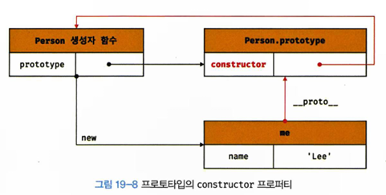

# 프로토타입
: JS는 클래스와(ES6에는 존재) 상속 public, private, protected 등의 캡슐화를 위한 키워드가 없어 객체지향언어가 아니라 오해를 하지만, JS는 프로토타입 기반의 객체지향 언어이다.

## 19.1 객체지향 프로그래밍
: **객체의 집합**으로 프로그램을 표현하려는 프로그래밍 패러다임을 말한다. 객체란, **상태 데이터와 동작을 하는 하나의 논리적인 단위로 묶은 복합적인 자료구조**이다.

## 19.2 상속과 프로토타입
생성자 함수를 통해 여러개의 인스턴스(객체)를 생성했을 때, 프로퍼티 값은 모두 달라도 되고, 다를 수 있으나 메서드는 동일한 내용이기에 단 하나만 생성해서 모든 인스턴스가 공유하는 것이 바람직하다. 객체안에서 메서드를 정의하면 인스턴스가 생성될 때마다 동일한 메서드를 생성하므로 메모리를 불필요하게 낭비한다.<br>
이때, 프로토타입을 기반으로 상속을 구현할 수 있다.
```
// 생성자 함수
function Circle(radus) {
    this.radius = radius;
    this.getArea = function() {
        return Math.PI * this.radius ** 2;
    };
}

const c1 = new Circle(1);
const c2 = new Circle(2);
// 동일한 메서드가 계속 생성


// 생성자 함수
function NewCircle(raidus) {
    this.radius = radius;
}

// 메서드 공유 - 프로토타입에 추가, 프로토타입은 NewCircle 생성자 함수의 prototype 프로퍼티에 바인딩 되어있다.
NewCircle.prototype.getArea = function() {
    return Math.PI * this.radius ** 2;
}

const c3 = new NewCircle(3);
const c4 = new NewCircle(4);

console.log(c3.getArea === c4.getArea); // true
```
 <br>
: NewCircle 생성자 함수가 생성한 모든 인스턴스는 자신의 프로토타입, 즉 상위 객체 역할을 하는 NewCircle.prototype의 모든 프로퍼티와 메서드를 상속받는다. 이는 **코드의 재사용** 관점에서 매우 유용

## 19.3 프로토타입 객체
: 프로토타입 객체는 객체간 상속을 구현하기 위해 사용. 객체의 상위 객체 역할을 하며 다른 객체에 공유 프로퍼티를 제공한다. <br>
모든 객체는 `[[Prototype]]`이라는 내부 슬롯을 가지며, 이 내부 슬롯의 값은 프로토타입의 참조다. 객체가 생성될때마다 생성 방식에 딸 프로토타입이 결정되고 `[[Prototype]]`에 저장된다. <br>
모든 객체는 프로토타입을 가지며, 이 프로토타입은 해당 객체의 생성자 함수와 연결되어 있다<br>
 <br>
`[[Prototype]]`에 직접 접근할 수 없고, `__proto__` 접근자 프로퍼티를 통해 프로토타입에 간접적으로 접근할 수 있다.<br>

콘솔에 객체를 출력하면 다음과 같은 프로토타입을 확인할 수 있다.
```
[[Prototype]]: Object
constructor: ƒ Object()
hasOwnProperty: ƒ hasOwnProperty()
isPrototypeOf: ƒ isPrototypeOf()
propertyIsEnumerable: ƒ propertyIsEnumerable()
toLocaleString: ƒ toLocaleString()
toString: ƒ toString()
valueOf: ƒ valueOf()
__defineGetter__: ƒ __defineGetter__()
__defineSetter__: ƒ __defineSetter__()
__lookupGetter__: ƒ __lookupGetter__()
__lookupSetter__: ƒ __lookupSetter__()
__proto__: (...)
get __proto__: ƒ __proto__()
set __proto__: ƒ __proto__()
```

### `__proto__`는 접근자 프로퍼티다.
접근자 프로퍼티(`__proto__`)는 자체적인 값을 갖지 않고 다른 데이터 프로퍼티 값을 읽거나 저장할 때 사용하는 접근자 함수(`[[Get]]``[[Set]]`)로 구성된 프로퍼티이다. 접근자 함수를 통해 취득, 할당한다. 
```
const obj = {};
const parent = { x: 1 };

obj.__proto__;
obj.__proto__ = parent;

console.log(obj.x); //1
```

### `__proto__` 접근자 프로퍼티는 상속을 통해 사용된다.
: `__proto__` 접근자는 객체가 직접 소유하는 프로퍼티가 아니라 Object.prototype의 프로퍼티다. `Object - Object.prototype - Object.prototype.__proto__` 의 프로토타입 체인으로 구성되어있다. 

### `__proto__` 접근자 프로퍼티를 통해 프로토타입에 접근하는 이유
: 상호 참조에 의해 프로토타입 체인이 생성되는 것을 방지하기 위함이다. 프로토타입 체인은 단방향 링크드 리스트로 구현되어야 한다. 서로를 참조하게되면 체인의 종점이 존재하지 않기 때문에 프로퍼티 검색 시, 무한 루프에 빠진다.

### `__proto__` 접근자 프로퍼티를 코드 내에서 직접 사용하는 것은 권장하지 않음
: 모든 객체가 `__proto__` 접근자 프로퍼티를 사용할 수 있는 것이 아니기 때문. 직접 상속을 통해 Object.prototype을 상속받지 않는 객체를 생성할 수도 있다.

- 함수 객체만이 소유하는 prototype 프로퍼티는 생성자 함수가 생성할 인스턴스의 프로토타입을 가리킨다. 따라서 non-constructor인 화살표 함수와 ES6 메서드 축약 표현으로 정의한 메서드는 prototype 프로퍼티를 소유하지 않으며 프로토타입도 생성하지 않는다. 생성자 함수로 호출하기 위해 정의하지 않은 일반함수(함수 선언문, 함수 표현식)도 prototype 프로퍼티를 소유하지만 객체를 생성하지 않는 일반 함수의 prototype 프로퍼티는 의미가 없다.<br>
모든 객체가 가지고 있는 `__proto__` 접근자 프로퍼티와 함수 객체만이 가지고 있는 prototype 프로퍼티는 결국 동일한 프로토타입을 가리키지만, 사용하는 주체가 다르다.<br>
| 구분          | 소유       | 값                   | 사용 주체   | 사용 목적                                                           |
|---------------|------------|----------------------|-------------|--------------------------------------------------------------------|
| `__proto__`   | 모든 객체  | 프로토타입의 참조     | 모든 객체   | 객체가 자신의 프로토타입에 접근 또는 교체하기 위해 사용             |
| `prototype`   | constructor| 프로토타입의 참조     | 생성자 함수 | 생성자 함수가 자신이 생성한 객체(인스턴스)의 프로토타입을 할당하기 위해 사용 |
<br>

- 모든 프로토타입은 constructor 프로퍼티를 갖고 이는 prototype 프로퍼티로 생성자 함수를 가리킨다. <br>
<br>
-> 무한 사이클? Person.prototype.constructor가 다시 Person을 참조하는 구조는 단지 생성된 객체가 자신의 생성자를 참조할 수 있게 하는 메커니즘일 뿐

> 근데 `__proto__` 방식은 구식이라고 합니다. 

## 19.4 리터럴 표기법에 의해 생성된 객체의 생성자 함수와 프로토타입
```
// 객체 리터럴 + 함수리터럴, 배열 리터럴, 정규표현식 리터럴...
const obj = {};

// 리터럴로 선언된 객체의 생성자 함수는 Object 생성자 함수다.
console.log(obj.constructor === Object); //true
```
: 리터럴 표기법으로 생성된 객체도 실제로는 자바스크립트에서 내부적으로 생성자 함수와 프로토타입을 사용하여 생성됩니다. 예를 들어, 객체 리터럴 {}로 만든 객체는 Object 생성자 함수를 통해 만들어지며, 이 객체의 프로토타입은 `Object.prototype`에 연결됩니다. 즉, 생성자 함수를 명시적으로 사용하지 않아도 자바스크립트는 내부적으로 생성자 함수와 프로토타입을 활용하여 객체를 생성합니다.

## 19.5 프로토타입의 생성 시점
: 프로토타입은 생성자 함수가 생성되는 시점에 더불어 생성된다. 프로토타입과 생성자 함수는 단독으로 존재할 수 없고 언제나 쌍으로 존재하기 때문이다. 

### 사용자 정의 생성자 함수와 프로토타입 생성 시점
생성자 함수로서 호출할 수 있는 함수, 즉 **constructor**는 함수 정의가 평가되어 **함수 객체를 생성하는 시점에 프로토타입도 함께 생성됨** <br>
생성자 함수로서 호출할 수 없는 함수, 즉 **non-constructor**는 **프로토타입이 생성되지 않는다**.

### 빌트인 생성자 함수와 프로토타입 생성 시점
Object, String, Number, Function ... 등과 같은 빌트인 생성자 함수도 일반 함수와 마찬가지로 빌**트인 생성자 함수가 생성되는 시점에 프로토타입이 생성된다**. <br>

객체가 생성되기 이전에 생성자 함수와 프로토타입은 이미 객체화되어 존재한다. 이후 생성자 함수또는 리터럴 표기법으로 객체를 생성하면 프로토타입은 생성된 객체의 `[[Prototype]]` 내부 슬롯에 할당된다. 이로써 생성된 객체는 프로토타입을 상속받는다.