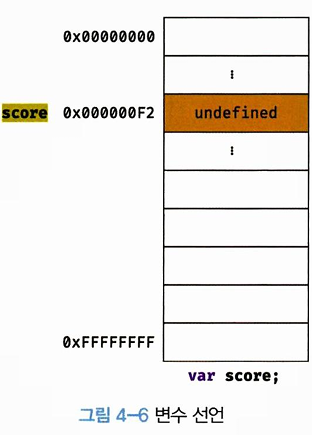
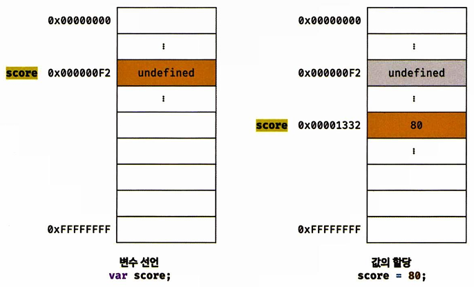
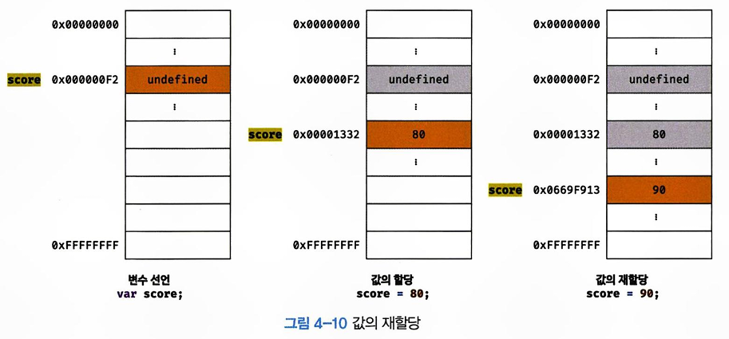

# Chapter4

## 4.1 변수란 무엇인가? 왜 필요한가?
변수는 하나의 값을 저장하기 위해 확보한 메모리 공간 자체 또는 그 메모리 공간을 식별하기 위해 붙인 이름이다.
컴퓨터는 `주소`를 가지고 메모리에 값을 저장한다. 하지만, 주소는 매번 바뀌기에 이를 직접적으로 메모리 제어를 허용하지 않는다. 그렇기에 기억하고 싶은 값을 메모리에 저장하고, 저장된 값을 재사용하기 위해 변수를 사용한다. 

## 4.2 식별자
식별자는 어떤 값을 구별해서 식별할 수 있는 고유한 이름을 말한다. 변수 이름을 '식별자'라고도 한다. 
식별자는 값이 아닌 '주소'를 기억하고 있다. 

## 4.3 변수 선언
변수 선언은 변수를 생성하는 것을 말한다. 정확히는, 메모리 공간을 `확보`하고 변수 이름과 확보된 메모리 공간의 주소를 `연결`해서 값을 저장할 수 있게 준비하는 것이다. 변수 선언은 `var` `let` `const` 키워드를 사용한다. 

### 1. 변수 선언 (메모리 공간 확보)
 <br/>
: 변수 이름 등록 및 메모리 공간 확보 -> 아직 값은 `undefined`

### 2. 초기화 
초기화는 변수가 선언된 이후 최초로 값을 할당하는 것을 말한다. `var`은 변수 선언과 함께 undefined값으로 바로 초기화 된다.`let`과 `const`는 초기화를 직접 해주어야 한다.

## 4.4 변수 선언의 실행 시점과 변수 호이스팅
변수 선언은 소스코드가 한 줄씩 순차적으로 실행되는 시점, 즉 런타임이 아니라 **그 이전 단계**에서 먼저 실행된다. 소스코드를 한 줄씩 순차적으로 실행하기에 앞서 먼저 소스코드의 평과 과정을 거치면서 소스코드를 실행하기 위한 준비를 하고, 선언이전에 사용되었다면(`var`은 제외), 참조에러가 발생한다.
이처럼 변수 선언문이 코드의 선두로 끌어 올려진 것처럼 동작하는 자바스크립트 고유의 특징을 `변수 호이스팅`이라 한다. 

## 4.5 값의 할당
4.3의 1, 2번 이후에 일어나는 일
변수에 값을 할당할 때는 할당연산자 `=`를 사용한다.
```
var score = 80;
```
변수 선언은 소스코드가 순차적으로 실행되는 시점인 런타임 이전에 먼저 실행되지만 값의 할당은 소스코드가 순차적으로 실행되는 시점인 **런타임에 실행**된다.<br/>
<br/>

## 4.6 값의 재할당
재할당이란 이미 값이 할당되어 있는 변수에 새로운 값을 또다시 할당하는 것이다. 값의 재할당은 `var` `let`만 가능하고, 변경이 안되도록 하고 싶다면, 상수인 `const`에 하도록 한다.<br/>
<br/>

## 4.7 식별자 네이밍 규칙
- 식별자는 특수문자를 제외한 문자, 숫자, 언더바(_), 달러 기호($)를 포함할 수 있다.
- 단, 식별자는 특수문자를 제외한 문자, 언더바(_), 달러 기호($)로 시작해야한다. 숫자로 시작하는 것은 허용하지 않는다.
- 예약어는 식별자로 사용할 수 없다.
- 한번에 여러개의 변수를 선언할 때는 쉼표(,)로 나누어 선언한다.
- 알파벳으로 변수를 선언하도록 한다.
- 변수는 대소문자를 구분한다.
- 변수는 존재 목적을 쉽게 이해할 수 있도록 의미를 명확히 표현해야 한다.
- 네이밍 컨벤션에 따르도록 한다.(**카멜 케이스**, **스네이크 케이스**, 파스칼케이스, 헝가리언 케이스)