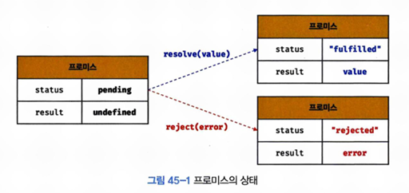

# 45장 프로미스

## 45.1 비동기 처리를 위한 콜백 패턴의 단점
자바스크립트에서는 비동기 처리를 위해 콜백 함수를 사용한다. 하지만, 이는 많아지면 가독성이 나쁘고 에러처리에 어려움을 겪을 수 있어 `Promise`가 도입되었다. 

### 콜백 헬
: 비동기 처리 결과에 대한 후속 처리를 수행하기 위해 함수가 중첩되는 현상 <br>

비동기 함수를 호출하면 함수 내부의 비동기로 동작하는 코드가 완료되지 않았다 해도 기다리지 않고 즉시 종료된다. 즉, 비동기 함수 내부의 비동기로 동작하는 코드는 비동기 함수가 종료된 이후에 완료된다. 그렇기 때문에 결과를 외부로 반환하거나, 상위 스코프의 변수에 할당하면 기대한대로 동작하지 않는다. 

```
let g = 0;

setTimeout(() => { g = 100; }, 0);
console.log(g); // 0
```

### 에러 처리의 한계
: try...catch 문을 사용해도, 에러가 발생해도 catch문으로 이동하지 않는다.<br>

=> 이러한 문제를 해결하기 위해서 Promise 사용

## 45.2 프로미스의 생성
```
const promise = new Promise((resolve, reject) => {
  if (/*비동기 성공*/) {
    resolve('result');
  } else {
    reject('fail');
  }
});
```

- 비동기 처리 성공 시, `fullfilled` 상태 변경
- 비동기 처리 실패 시, `reject` 상태 변경

## 45.3 프로미스의 후속 처리 메서드

### Promise.prototype.then
- 첫 번째 함수는 `fullfilled` 상태가 되면 호출. 콜백 함수는 프로미스의 비동기 처리 결과를 인수로 전달받는다. 
- 두 번째 함수는 `reject` 상태가 되면 호출. 프로미스의 에러를 인수로 전달받는다.

### Promise.prototype.catch
: `reject` 상태인 경우만 호출된다.

### Promise.prototype.finally
: 상태와 상관없이 무조건 한 번만 호출된다. 공통적으로 수행해야할 내용이 있을 때 사용한다.

## 45.4 프로미스의 에러처리
- `then`
- `catch`
- `finally`

## 45.5 프로미스 체이닝
: .then()은 항상 새 프로미스를 반환한다. 이전 프로미스에서 처리한 결과를 새 프로미스에서 이어받을 수 있다.
```
Promise.resolve(1)
  .then(result => {
    console.log(result); // 1
    return result + 1;
  })
  .then(result => {
    console.log(result); // 2
    throw new Error('Something went wrong');
  })
  .then(
    result => console.log(result), // 실행되지 않음
    error => console.log('Handled error:', error.message) // 실행됨
  );
```

## 45.6 프로미스의 정적 메서드

### Promise.resolve
: 이미 존재하는 값을 래핑하여 프로미스를 생성하기 위함으로, 인수로 전달받은 값을 resolve하는 프로미스를 생성한다.

### Promise.reject
: 이미 존재하는 값을 래핑하여 프로미스를 생성하기 위함으로,  인수로 전달받은 값을 reject하는 프로미스를 생성한다.

### Promise.all
: 여러 개의 비동기 처리를 모두 병렬처리할 때 사용. 모든 프로미스가 fulfilled 상태가 되는 것을 기다린다.

### Promise.race
: Promise.all와 같이 배열 등의 이터러블을 인수로 전달받지만, Promise.all와 다르게 가장 먼저 fulfilled 상태가 된 프로미스의 처리결과를 resolve하는 새로운 프로미스 반환.

### Promise.allSettled
: 전달받은 프로미스가 모두 settled 상태(fulfilled or reject)가 되면 상태를 반환

## 45.7 마이크로태스크 큐
: 프로미스의 후속 처리 메서드의 콜백 함수는 태스크 큐가 아니라 마이크로태스크 큐에 저장된다. 이는 태스크 큐보다 우선순위가 높다. 

## fetch
: HTTP 요청 전송 기능을 제공하는 클라이언트 사이드 Web API. fetch 함수는 HTTP 응답을 나타내는 Response 객체를 래핑한 Promise 객체를 반환한다. 