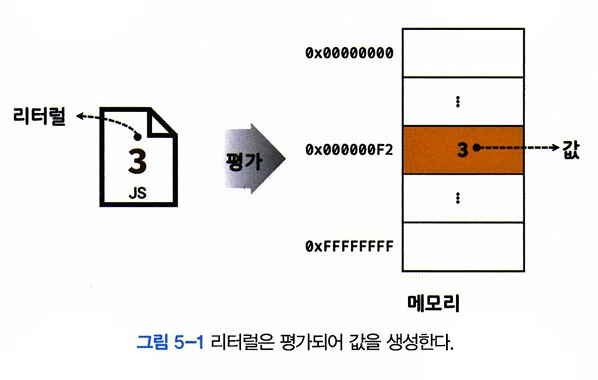

# 표현식과 문

## 5.1 값
값은 식(표현식)이 평가되어 생성된 결과를 말한다. 변수는 **하나의 값**을 저장하기 위해 확보한 메모리 공간 자체 또는 그 메모리 공간을 식별하기 위해 붙인 이름이다. 따라서 변수에 할당되는 것은 값이다.
```
// sum 변수에 10 + 20이 평가되어 값 30이 할당된다.
var sum = 10 + 20;
```

## 5.2 리터럴
리터럴은 사람이 이해할 수 있는 문자 또는 약속된 기호를 사용해 값을 생성하는 표기법을 말한다. ex: 숫자 3은 리터럴 이다.<br/>
<br/>

## 5.3 표현식
표현식은 값으로 평가될 수 있는 문이다. 즉, 표현식이 평가되면 새로운 값을 생성하거나 기존값을 참조한다.
```
var score = 100;
```
: 100은 리터럴이다. 리터럴도 값으로 평가된다. 그렇기에 리터럴은 그 자체로 표현식이다.
```
var score = 50 + 50;
```
: 50 + 50은 평가되어 숫자 값 100을 생성하므로 표현식이다.

```
score;
```
: 변수 식별자를 참조하면 변수 값으로 평가된다. 값을 생성하진 않지만 값으로 평가되므로 표현식이다.<br/>
=> 결론적으로, 값으로 평가될 수 있는 문은 모두 **표현식**이다.

## 5.4 문
문은 프로그램을 구성하는 기본 단위이자 최소 실행 단위이다. 문이 실행되면 명령이 실행되고 무슨일인가 일어나게 된다. 문은 `선언문`, `할당문`, `조건문`, `반복문` 등으로 구분할 수 있다.

## 5.5 세미콜론과 세미콜론 자동 삽입 기능
세미콜론(;)은 문의 종료를 나타낸다. 즉, 자바스크립트 엔진은 세미콜론으로 문이 종료한 위치를 파악하고 순차적으로 하나씩 문을 실행한다. 따라서 문을 끝낼 때는 세미콜론은 붙여야한다.
**하지만, 자바스크립트는 작성해주지 않아도 된다.** 자바스크립트 엔진이 소스 코드를 해석할 때 문의 끝이라고 예측되는 지점에 세미콜론을 자동으로 붙여주는 **세미콜론 자동 삽입 기능**이 암묵적으로 수행된다.

## 5.6 표현식인 문과 표현식이 아닌 문
표현식인 문과 표현식이 아닌 문을 구별하는 가장 간단하고 명료한 방법은 변수에 할당해 보는 것이다. 
```
// 표현식이 아닌 문
// var some = var x; 는 성립되지 않는다.
var x;

// 표현식
// var some = x = 1 + 2; 는 성립한다.
x = 1 + 2;
```
