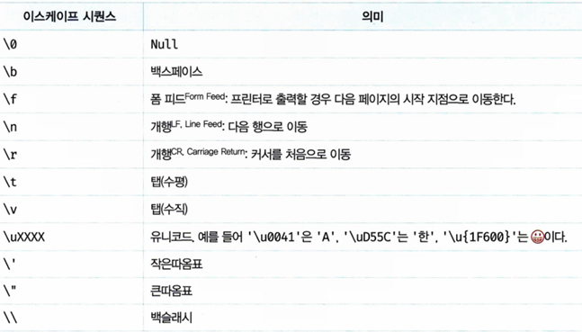

# 데이터 타입

## 6.1 숫자 타입
C와 자바의 경우에서 int, long, float, double과 같다.
숫자 타입은 **모든 수를 실수**로 처리한다. 그리고 아래와 같이 특별한 값도 표현할 수 있다.
- `Infinity` : 양의 무한대
- `-Infinity` : 음의 무한대
- `NaN` : 산술 연산 불가 (수가 아닌 것)

## 6.2 문자열 타입
문자열 타입은 텍스트 데이터이다. 문자열은 작은따옴표 (''), 큰따옴표(""), 백틱(``)으로 텍스트를 감싼다.<br/>

## 6.3 문자열 리터럴
일반 문자열 내에서는 줄바꿈이 허용되지 않는다. 그렇기에 이스케이프 시퀀스를 사용해야 한다. 그리고, 일반문자열과 다르게 템플릿 리터럴 내에서는 이스케이프 시퀀스를 사용하지 않고도 줄바꿈이 허용된다.(공백 포함)<br/>
<br/>
문자열은 문자열 연산자 +를 사용해 연결할 수 있다. 

### Airbnb JavaScript 문자열 가이드(대표적인 JS 컨벤션)
- 문자열은 작은따옴표('')사용을 권장하고 있다.
- 또한, 100자가 넘는 문자열을 문자열 연결을 이용해 여러 줄에 걸쳐 쓰지 않도록 한다.
```
// bad 
const  errorMessage =  'This is a super long error that  was thrown because '  + 
'of Batman. When you stop to think about how Batman  had anything to do '  + 
'with this, you would get nowhere fast.' ; 
// good 
const  errorMessage =  'This is a super long error that  was thrown because of 
Batman. When you stop to think about how Batman had anything to do with this, you 
would get nowhere fast.' ; 
```
- 문자열을 생성하는 경우, 가독성을 위해 문자열 연결 대신 템플릿 문자열을 사용하도록 한다.
```
// bad 
function  sayHi  (name)  { 
return  'How are you, '  + name +  '?' ; 
} 
// bad 
function  sayHi  (name)  { 
return  [ 'How are you, ' , name,  '?' ].join(); 
} 
// bad 
function  sayHi  (name)  { 
return  `How are you,  ${ name } ?` ; 
} 
// good 
function  sayHi  (name)  { 
return  `How are you,  ${name} ?` ; 
} 
```
- 문자열에 불필요한 이스케이프 문자를 사용하지 않도록 한다. : 가독성을 해침
```
// bad 
const  foo =  '\'this\' \i\s \"quoted\"' ; 
// good 
const  foo =  '\'this\' is "quoted"' ; 
const  foo =  `my name is ' ${name} '` ;
```
- 문자열에 eval()을 사용하지 않도록 한다.

## 6.4 불리언 타입
true/false

## 6.5 undefined 타입
변수를 선언한 이후 값을 할당하지 않았을 때, undefined가 된다. 직접 없는 값을 넣어주고 싶을 땐 `null`을 사용하도록 한다.

## 6.6 null 타입
변수에 값이 없다는 것을 **의도적으로 명시**할 때 사용한다. 참조를 명시적으로 제거하는 것을 의미한다.

## 6.7 심벌 타입
변경 불가능한 원시 타입의 값이다. 심벌 값은 다른 값과 중복되지 않는 유일무이한 값이다. 따라서 주로 이름이 충돌할 위험이 없는 객체의 유일한 프로퍼티 키를 만들기 위해 사용한다. 

## 6.8 객체 타입
자바스크립트는 원시 타입 / 객체 타입으로 분류한다. 이후에 자세히 다룰 것.

## 6.9 데이터 타입의 필요성
- 데이터 타입에 의한 메모리 공간의 확보와 참조 : 자바스크립트 엔진은 데이터 타입, 즉 값의 종류에 따라 정해진 크기의 메모리 공간을 확보한다. 
- 데이터 타입에 의한 값의 해석 : 모든 값은 데이터 타입을 가지며, 메모리에 2진수, 즉 비트의 나열로 저장된다. 메모리에 저장된 값은 데이터 타입에 따라 다르게 해설될 수 있다. 

## 6.10 동적 타이핑
자바스크립트는 정적 타입 언어(C, Java...)와 다르게 변수를 선언할 때 타입을 선언하지 않는다. 어떠한 데이터 타입의 값이라도 자유롭게 할당할 수 있다. <br/>
자바스크립트 변수는 선언이 아닌 할당에 의해 타입이 결정된다. 그리고 재할당에 의해 변수의 타입은 언제든지 동적으로 변할 수 있다. 이러한 특징은 **동적 타이핑**이라하며, 자바스크립트는 **동적 타입 언어**이다.