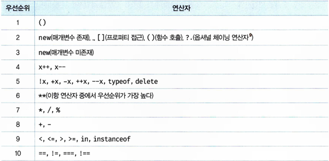

# 7장 연산자

## 7.1 산술 연산자
산술 연산자는 피연산자를 대상으로 수학적 계산을 수행해 새로운 숫자 값을 만든다. 산술 연산이 불가능한 경우, `NaN`을 반환한다.<br/>
이항 산술 연산자<br/>
- `+` : 덧셈
- `-` : 뺄셈
- `*` : 곱셈
- `/` : 나눗셈
- `%` : 나머지

이항 산술 연산자<br/>
- `++` : 증가
- `--` : 감소
- `-` : 양수를 음수로, 음수를 양수로

문자열 연결은 **+연산자**로 한다.

## 7.2 할당 연산자
: 변수에 할당하는 연산자
- `=` : 할당
- `+=` : 덧셈 후 할당
- `-=` : 뺄셈 후 할당
- `*=` : 곱셈 후 할당
- `/=` : 나눗셈 후 할당
- `%=` : 나머지 할당

## 7.3 비교 연산자
피연산자를 비교하고, 결과를 boolean 값으로 반환 <br/>

**동등/일치 연산자**
- `==` : 동등 비교 (사용을 지양하도록 한다.)
- `===` : 일치 비교 (타입까지 확인)
- `!=` : 부동등 비교 (사용을 지양하도록 한다.)
- `!==` : 불일치 비교 (타입까지 확인)

**대소 관계 비교 연산자**
- `>` : 좌항이 크다
- `<` : 우항이 크다
- `>=` : 좌항이 크거나 같다
- `<` : 우항이 크거나 같다.

## 7.4 삼항 연산자
```
// 조건식 ? 조건식이 true일 때 반환할 값 : 조건식이 false일 때 반환할 값
// ex
let answer = score >= 60 ? 'pass' : 'fail';
```

## 7.5 논리 연산자
- `||` : 논리합(OR)
- `&&` : 논리곱(AND)
- `!` : 부정(NOT)

## 7.6 쉼표 연산자
왼쪽 피연산자부터 차례로 피연산자를 평가하고 마지막 평가가 끝나면 마지막 피연산자의 평과결과를 반환한다.

## 7.7 그룹 연산자
소괄호('()')로 피연산자를 감싸는 그룹 연산자는 *연산자 우선순위*가 높아진다.

## 7.8 typeof 연산자
피연산자의 데이터 타입을 문자열로 반환한다. `null`을 반환하는 경우는 없으며, 함수는 `function`을 반환한다. 

## 7.9 지수 연산자
- ` a**b` : a의 b승
- `Math.pow(a, b)` : a의 b승

## 7.10 그 외의 연산자
- `?.` : 옵셔널 체이닝 연산자
- `??` : null 병합 연산자
- `delete` : 프로퍼티 삭제
- `new` : 생성자 함수를 호출할 때 사용하여 인스턴스를 생성
- `instanceof` : 좌변의 객체가 우변의 생성자 함수와 연결된 인스턴스인지 판별
- `in` : 프로퍼티 존재 확인

## 7.11 연산자의 부수 효과
할당 연산자(=), 증가/감소 연산자(++/--), delete 연산자는 부수 효과가 있다.

## 7.12 연산자 우선순위
<br/>
<br/>

## 7.13 연산자 결합 순서
