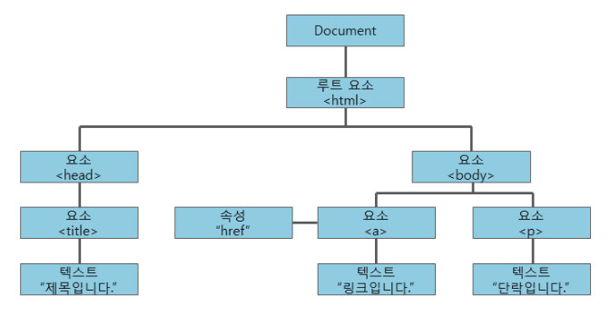
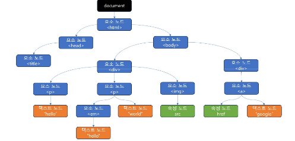

## DOM이란?
: 웹 페이지의 구조를 **객체** 형태로 표현한 것으로, 자바스크립트와 같은 프로그래밍 언어가 웹 페이지의 HTML이나 XML 문서에 접근하고 조작할 수 있도록 만들어주는 인터페이스이다. 즉, 웹 페이지의 문서를 프로그래밍 적으로 제어할 수 있는 방법을 제공한다.

## DOM의 역할
1. HTML 문서를 구조화 하여 트리 형태의 구조로 표현
2. 웹 페이지의 각 요소를 객체로 표현하여 프로그래밍 언으를 통해 동적으로 접근하고 수정가능
3. 자바스크립트를 통해 웹 페이지의 콘텐츠, 스타일, 구조를 실시간으로 변경가능



## Node
: DOM 트리의 기본 단위입니다. DOM의 요소, 속성, 텍스트 등 모든 것은 Node 객체이다.

### DOM 노드
- 요소 노드 : 태그를 지칭하는 노드
- 속성 노드 : 태그의 속성을 지칭하는 노드
- 텍스트 노드 : 태그의 바디에 작성된 글을 지칭하는 노드
- 주석 노드 : 문서의 주석을 지칭하는 노드


## 속성(Attribute)
: **HTML 요소에 설정된 값으로, HTML 문서 안에 존재하는 정보이다.** 웹 페이지가 처음 로드될 때 브라우저가 해석하는 요소의 초기 상태를 정의. HTML 태그 내에서 선언된 **정적 값**이며, **값은 문자열로 저장**된다.
```
<input type="text" value="Hello" id="myInput" disabled>
```

## 프로퍼티(Property)
: **DOM 객체가 가지고 있는 동적 속성**으로, 자바스크립트로 접근할 수 있는 값이다.DOM에서 요소가 실시간으로 가지는 상태나 값을 나타낸다. 브라우저가 HTML을 해석해 DOM 객체를 생성한 후 **자바스크립트로 접근하거나 수정할 수 있는 동적 속성**이다.
```
const inputElement = document.getElementById('myInput');

// 속성에 접근
console.log(inputElement.getAttribute('value')); // "Hello"

// 프로퍼티에 접근
console.log(inputElement.value); // "Hello"

// 속성 값 변경
inputElement.setAttribute('value', 'Hi');

// 프로퍼티 값 변경
inputElement.value = 'Hi';
```
- `getAttribute()` : DOM 요소에서 속성 값을 가져오는 함수. 주어진 요소에서 속성이 존재할 경우, 그 속성의 값을 **문자열로 반환**. 만약 속성의 **값이 존재하지 않으면 빈 문자열**을 반환하고, 해당 요소에서 **일치하는 속성이 없다면 null을 반환**
- `setAttribute()` : DOM 요소에 속성 값을 설정하는 함수. 속성이 **이미 존재하는 경우 값이 업데이트**. 그렇지 않으면 **지정된 이름과 값으로 새 속성이 추가**
- `removeAttribute()` : DOM 요소에서 매개변수로 지정하는 속성을 제거하는 함수. **매개변수가 없으면 오류를 발생**시키지만, 매개변수로 지정하는 속성이 요소에 없어도 오류 없이 아무 동작도 하지 않음.
- `hasAttribute()` : DOM 요소에 지정한 속성이 있는지 체크하는 함수. 해당 요소에 **지정한 속성이 있으면 true를 반환하고, 없으면 false**를 반환

## DOM 요소 선택, Node Selector
- `getElementById()` : 특정 id 속성을 가진 요소 하나를 선택할 때 사용
```
let element = document.getElementById('myElement'); // 'myElement'라는 id를 가진 요소 선택
```

- `querySelector()` : CSS 선택자를 사용하여 문서 내의 첫 번째로 일치하는 요소 하나를 선택
```
let element = document.querySelector('.myClass'); // 'myClass' 클래스를 가진 첫 번째 요소 선택
```
- `querySelectorAll()` : CSS 선택자를 사용하여 문서 내의 모든 일치하는 요소를 모두 선택. 일치하는 요소를 NodeList 객체로 반환.
```
let elements = document.querySelectorAll('.myClass'); // 'myClass' 클래스를 가진 모든 요소 선택
```

- `getElementsByName()` : 태그에 name 속성을 설정하고, 속성값으로 노드를 획득
```
let idInput = document.getElementsByName('id'); //name이 'id'인 요소 선택
```
- `getElementsByClassName()` : 특정 클래스명을 가진 모든 요소를 선택. 주어진 클래스명을 가진 요소들을 HTMLCollection으로 반환. HTMLCollection은 실시간으로 동적이므로 DOM에 변화가 생기면 자동으로 업데이트
```
let elements = document.getElementsByClassName('myClass'); // 'myClass' 클래스를 가진 모든 요소 선택
```
- `getElementsByTagName()` : 특정 태그명을 가진 모든 요소를 선택. 주어진 태그명을 가진 요소들을 HTMLCollection으로 반환
```
let elements = document.getElementsByTagName('div'); // 모든 <div> 요소 선택
```

## 타켓팅과 캡처링/버블링
: 노드는 트리구조로 구성되고 트리구조의 여러 노드에 이벤트 핸들러가 등록될 수 있다. 실행 순서를 신경쓰거나 이벤트 실행을 취소 시켜야 할 수 있다. 

- **타겟팅** : 이벤트가 발생한 정확한 요소
- **캡처링** : 이벤트 발생 시, 상위 노드 부터 하위 노드로 이벤트가 전파
- **버블링** : 이벤트가 발생한 노드 부터 상위 노드로 이벤트가 전파

하나의 이벤트가 발생하면, 캡처링과 버블링 단계를 거치며 여러 노드에 등록된 이벤트 핸들러가 실행되게 되는데 이때, 캡처링 단계에서 실행될지, 버블링 단계에서 실행될지 제어 가능
- `addEventListener()`
```
addEventListener(type, listener, useCapture)
// 3번째 매개변수는 true/false 값을 가진다.
// true일 때, 캡처링 단계에서 이벤트가 처리됨
// false일 때, 캡처링 단계에서 이벤트가 처리됨 (기본값)
```

- `preventDefault()`
: 이벤트를 중단시키는 방법. 노드에 기본으로 등록된 이벤트가 처리되지 않게 하기 위함 (ex. form태그에서 페이지가 새로고침되는 것을 방지, a태그에서 페이지 이동하지 않도록)
- `stopPropagation()`
: 캡처링과 버블링을 중단시키는 함수

## 스타일 이용
- CSS는 대소문자를 구별하지 않기에 Snake case
- JS에서의 CSS는 대소문자를 구별하기에 Camel case
<br>

- `getComputedStyle()` : 외부에서 정의해서 적용된 스타일을 획득하고자 하면, 노드의 style속성은 이용불가하고 getComputedStyle() 함수를 사용해야 한다.
```
console.log(getComputedStyle(area2).width) // 200px
```

## Node 객체 생성
- `creatElement()` : 요소 노드 생성
- `creatAttribute()` : 속성 노드 생성
- `creatTextNode()` : 텍스트 노드 생성
- `appendChild()` : 노드 객체 추가. 노드 객체는 트리로 구성됨으로 어떤 노드를 다른 노드에 추가해 화면을 구성하기 위해 사용
- `insertBefore()` : appendChild는 새로 추가하는 노드는 마지막 부분에 추가. 노드를 특정 위치에 추가하고 싶다면 inserBefore 함수 이용.
```
list.insertBefore(newItem, list.childNodes[0]);
```

## Node 객체 삭제
- `removeChild()` : 부모 노드에서 자식 노드를 삭제하기 위한 함수. 매개변수에 삭제하고자 하는 노드를 정하면 된다.
```
newItem.addEventListener('click', function() {
    console.log('1');
    list.removeChild(this);
})
```