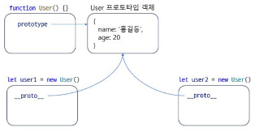

# Prototype

## Prototype이란?
1. 자바스크립트에서 객체를 생성하면, 그 객체는 자동으로 숨겨진 링크인 [[Prototype]]을 통해 프로토타입 객체와 연결됩니다. 이 프로토타입은 해당 객체가 상속받을 속성과 메서드를 제공하는 역할을 합니다.
2. 프로토타입에 변수나 함수를 추가하면, 해당 프로토타입을 공유하는 모든 객체가 그 변수나 함수를 사용할 수 있게 됩니다. 즉, 프로토타입에 정의된 속성과 메서드는 여러 객체가 공통으로 사용할 수 있는 공유 자원이 됩니다.

- 프로토타입 객체에 constructor라는 생성자가 추가되어 있다. 함수를 이용해 객체를 생성한다는 의미는 사실 프로토타입의 생성자를 이용하는 것이다.
- 객체를 생성할 수도 있다. 추가된 멤버는 그 함수를 이용해 생성되는 여러 객체가 공유한다.
```
// 멤버 등록
함수명.prototype.멤버명

// 멤버 사용
객체명.멤버명
```


## this
- 객체를 위한 프로퍼티, 함수를 this 멤버로 선언할 수도 있고 프로토타입 멤버로 선언할 수도 있다. 
- **this의 멤버는 객체별 다른 데이터가 유지**되지만, **프로토타입의 멤버는 여러 객체가 만들어져도 모두 동일 데이터**를 가진다. this는 객체별로 다른 메모리 할당, 프로토타입은 하나로 공유
- this와 프로토타입에 동일 이름의 멤버가 선언가능한데, **this에 선언된 멤버가 이용**된다. 객체로 어떤 멤버에 접근하면 먼저 자신의 메모리에서 찾고, 없다면 프로토타입에 접근
```
function User(name) {
    this.name = name;
    User.prototype.point = 20;
    User.prototype.sayHello = function() {
        console.log(`Hello ${this.name}, point: ${this.point}`);
    }
}

let user1 = new User('유진');
user.sayHello(); // Hello 유진, point: 20

let user2 = new User('장유진');
user2.point = 30
user.sayHello(); // Hello 유진, point: 30
```

## 메모리 효율성
: 함수를 선언하는 경우에 메모리에서 많은 이득을 볼 수 있다. 함수는 대부분 로직이 동일한 경우가 많기 때문.

## 상속 구현
: 상속은 어떤 객체에 선언된 멤버를 그대로 이어받아 새로운 객체를 선언하는 기법. 코드 재사용 측면에서 매우 유리하다. JS에서는 프로토타입을 통해 상속을 구현한다.

### 상위 객체를 하위 프로토타입으로 지정
```
function Shape(name) {
  this.name = name;
}

Shape.prototype.draw = function() {
  console.log(`${this.name} 도형을 그립니다.`);
};

function Rectangle(name, width, height) {
  Shape.apply(this, [name]);  // Shape을 상속받아서 사용하는 방법
  this.width = width;
  this.height = height;
}

Rectangle.prototype = new Shape();

function RoundRectangle(name, width, height, radius) {
  Rectangle.apply(this, [name, width, height]);  // Rectangle을 상속받음
  this.radius = radius;
}

RoundRectangle.prototype = new Rectangle();
```
: 상위 함수의 객체를 하위 함수의 프로토타입으로 지정해 상위에 선언된 것을 하위에서 이용하게 하기 (다른 언어의 상속 개념 (ex. java에서 `extends Shape`, `super(name)`))

- 상위의 프로토타입을 그대로 하위에서 프로토타입으로 이용하게 할 수 있다.
```
function Rectangle(name, width, height) {
  Shape.apply(this, [name]);
  this.height = height;
}
Rectangle.prototype = Shape.prototype;

function RoundRectangle(name, width, height, radius) {
  Rectangle.apply(this, [name, width, height]);
  this.radius = radius;
}
RoundRectangle.prototype = Rectangle.prototype;
```
: 프로토타입이 공유되어 상속구조가 깨질 수 있다. 

```
Rectangle.prototype = Object.create(Shape.prototype);
Rectangle.prototype.constructor = Rectangle;

RoundRectangle.prototype = Object.create(Rectangle.prototype);
RoundRectangle.prototype.constructor = RoundRectangle;
```
: 이 방식이 각 클래스가 서로 다른 프로토타입 객체를 갖게 되며 독립적인 상속 구조를 유지할 수 있다.