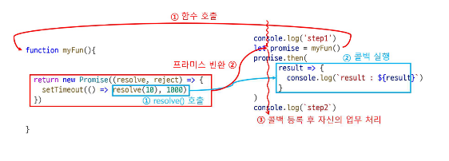

# 동기 / 비동기

## setTimeout()
: 일정 시간이 지난 후 함수 실행
```
setTimeout(functionRef, delay, param1, param2,..., paramN)
```
- 취소 방법: clearTimeout()을 사용해 예약된 함수를 취소할 수 있다.

## setInterval()
: 일정 시간 간격으로 반복적 함수 실행
```
setInterval(func, delay, arg1, arg2, ..., argN)
```
- 취소 방법: clearInterval()을 사용해 반복 실행을 취소할 수 있다.
- 호출 주기: 함수 호출 주기는 설정한 시간이 기준. 예를 들어, 1초로 설정했을 때, 함수 실행 시간이 0.5초면 0.5초 후에 다시 호출된다.
- 연속 호출 시 대안: 실행이 끝난 후 다음 호출을 설정하려면 setTimeout()을 재귀적으로 중첩하여 사용할 수 있다.
```
let sayHello = async() => {
    console.log('Hello');
    setTimeout(sayHello, 1000);
}
setTimeout(sayHello, 1000);
```

## 동기/비동기
- 동기: 함수가 끝날 때까지 다른 작업을 진행하지 못한다.
- 비동기: 함수가 실행되는 동안 다른 작업을 동시에 실행할 수 있다.

## Promise
- 역할: 비동기 작업의 완료 여부와 결과를 처리하기 위한 객체.
- 개념: 비동기 작업이 끝났는지, 그 결과가 무엇인지 알 수 있게 해주는 약속.

### 사용방법
1. Promise 생성:
- 비동기 작업을 실행하는 함수는 Promise 객체를 반환한다.
- Promise는 실행과 동시에 내부 비동기 작업을 시작하고, resolve() 또는 reject()로 결과를 반환한다.
```
function myFunc() {
    return new Promise((resolve, reject) => {
        setTimeout(() => resolve(10), 1000);
    });
}
```

2. 결과 처리: 
- then() 메서드로 비동기 작업이 완료되었을 때 실행할 콜백 함수를 등록해 결과를 처리한다.
```
myFunc().then(result => {
    console.log(result);  // 10
});
```


### 작성 규칙
1. Promise 생성 - `executor`
- 비동기 코드 실행 시, 호출한 코드가 대기하지 않도록 Promise 객체를 생성하고 반환.
- Promise 생성 시 `executor` 함수를 지정하며, 이 함수는 비동기적으로 즉시 실행된다.
- Promise 객체는 내부적으로 `state`와 `result`를 유지하며, **state**는 `pending`, `fulfilled`, `rejected`의 상태를 갖는다.
- executor 함수가 호출될 때, 처음에 `state`는 `pending` 상태를 나타낸다.

2. Promise 결과 발생 - `resolve`
- 비동기 작업이 완료되면 `resolve` 함수가 호출되어 결과를 전달한다.
- resolve를 호출하면 Promise의 `state`는 `fulfilled`로 바뀌고, `result`는 `작업의 결과`가 된다.
```
new Promise((resolve, reject) => {
  setTimeout(() => resolve('완료됨'), 1000);
});
```

3. Promise 결과 발생 - `reject`
- 에러가 발생할 경우 `reject` 함수를 호출하여 에러 정보를 전달한다.
- reject가 호출되면 Promise의 `state`는 `rejected`로 바뀌고, `result`는 `에러 정보`를 담게 된다.
```
new Promise((resolve, reject) => {
  setTimeout(() => reject(new Error('에러 발생')), 1000);
});
```

4. Promise 콜백 - `then`
- Promise에서 발생한 값을 처리하기 위해 `then()` 메서드를 사용한다.
- **then()**의 첫 번째 인자는 **resolve가 호출될 때 실행되는 함수**, 두 번째 인자는 **reject가 호출될 때 실행되는 함수**이다.

5. `catch`, `finally`
- catch(): reject에 의해 발생한 에러를 처리하는 콜백을 등록.
- finally(): resolve나 reject와 상관없이 무조건 실행되는 코드를 등록.
```
promise
  .then(result => console.log(result))
  .catch(error => console.log(error))  // reject 처리
  .finally(() => console.log('작업 종료'));  // 무조건 실행
```

## async/await
### async
: 함수 앞에 `async` 키워드를 붙이면 해당 함수는 Promise를 반환. 내부적으로는 await 키워드를 통해 비동기 작업을 동기적인 코드처럼 작성할 수 있다.
```
async function myFun() {
    return 7;
}
myFun().then(value => console.log(value));  // 7
```

### await
: await는 "기다리다"라는 의미를 가지며, async 함수 내에서 `await`로 선언된 구문이 완료될 때까지 기다립니다.
```
async function myFun() {
    let data = await getData();
    console.log(data);
}
```

1. await를 이용한 순차적 실행
- await를 사용하면 비동기 작업들을 순차적으로 실행할 수 있다.
- 예를 들어 funA와 funB라는 두 함수가 있다면, funA가 완료된 후에야 funB가 실행되도록 만들 수 있다.
```
async function myFun() {
    console.time();
    let aData = await funA();
    console.log(aData);
    let bData = await funB();
    console.log(bData);
    console.timeEnd();
}
```

2. await를 이용한 동시 실행
- 비동기 작업이 동시에 실행되어도 되는 경우, await를 적절히 배치하면 두 작업이 동시에 시작되도록 할 수 있다.
- 두 함수가 동시에 실행되면 전체 실행 시간을 단축할 수 있다.
```
async function myFun() {
    let aData = funA();  // 바로 실행
    let bData = funB();  // 바로 실행
    console.log(await aData);  // 결과 기다림
    console.log(await bData);  // 결과 기다림
}
```

3. Promise.all을 통한 동시 실행
- `Promise.all()`을 사용하면 여러 비동기 작업을 동시에 처리할 수 있다.
- 배열로 전달된 모든 Promise가 완료될 때까지 기다리고, 모든 결과를 배열로 반환한다.
- 모든 비동기 작업이 완료된 후, then()을 통해 결과를 처리할 수 있다.
```
async function myFun() {
    Promise.all([funA(), funB()]).then((values) => {
        console.log(values);  // 두 함수의 결과가 배열로 반환됨
    });
}
```